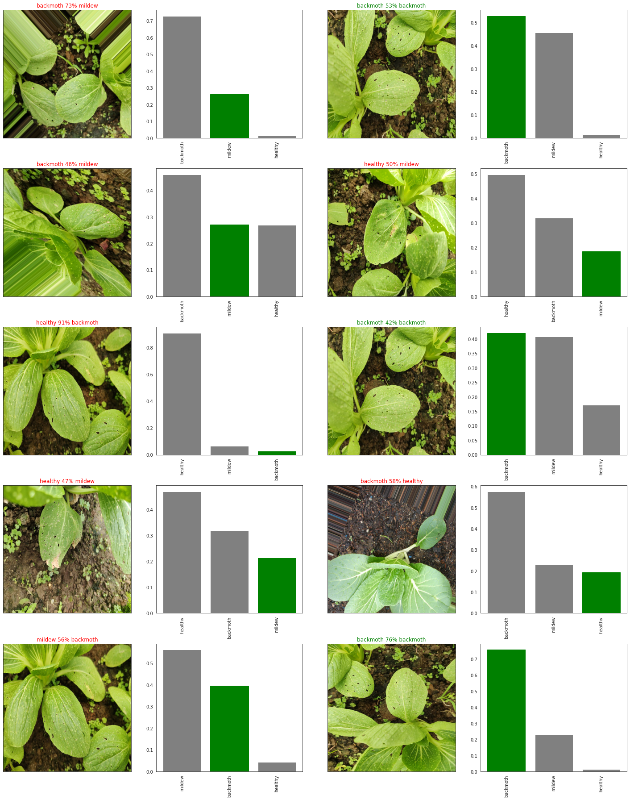
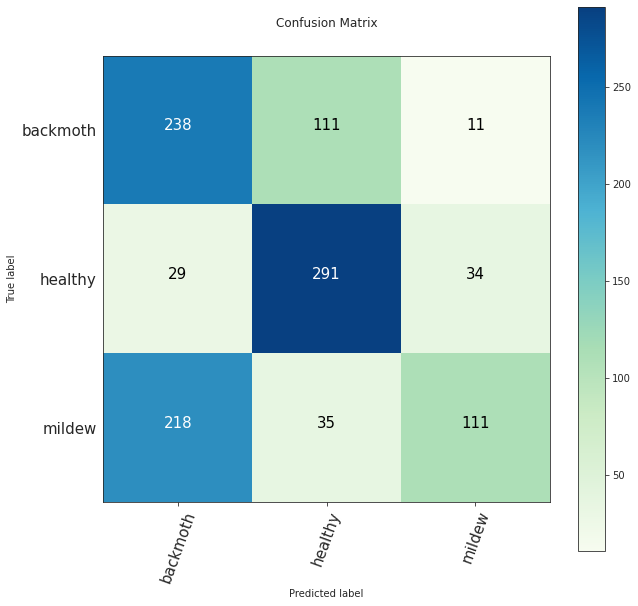
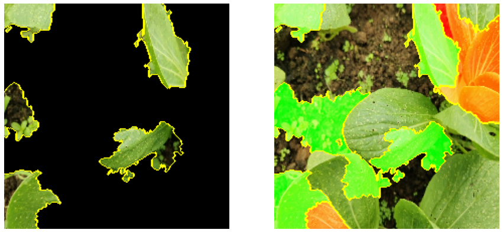
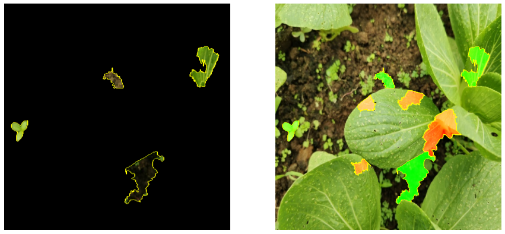

# Predicting Diseases in Chinese Cabbage

## Problem Statement

With an increase in sustainable growth, Singapore has started to expand on urban farms and community gardens. By providing ML solutions to hobbyist and volunteers with little to no experience, this project aims to assist them to identify common diseases in Chinese cabbage.

## Methodology

For this project, we will utilize an image dataset from [Kaggle](https://www.kaggle.com/giane901/chinese-cabbage-disease-detection). The images were pre-labelled with 3 different types of diseases: Backmoth, Leafminer and Mildew.

Typically, Backmoth or Diamond-back Month caterpillars eat the leaves aggressively, leaving large, distinct holes on the leaves. Leafminer or Leafminer Maggots tend to bore into the leaves while eating, leaving a distinct trail of squiggly yellow lines on the leaves. Mildew is a type of fungi that grows on the leaves, resulting in malnutrition on the leaves, leaving yellowing blotches or even withering.

With that information in mind, we will develop a neural network model to assist in diagnosing these blights in Chinese Cabbage.

### Metrics and Diagnostic Tools

Evaluation of the final model is done on several metrics, the primary being F1 score, followed by precision, recall and accuracy.

In order to further analyze the model's predictions, LIME was used, as well as confusion matrix and confidence plots.

### Data Augmentations

Data augmentation is applied before fitting into the model. The following transforms were used:

- Rescale and resizing
- Random Rotation
- Random width and height shifts
- Random horizontal and vertical flips
- Random zoom
- Random shear
- Random brightness

### Oversampling Minority Classes

In order to deal with the data imbalance, we also manually oversample the minority classes using Keras' ImageDataGenerator. We sampled in batch size of 32 at a time to generate similar amounts of images between classes. We also opted to drop the leafminer class due to its similarity to the other 2 classes and include a healthy class to aid in the classification process.

### Modelling with Transfer Learning

Several transfer learning models were used including but not limited to MobileNet, EfficientNet and Inception. The final model was done exclusively in EfficientNetB6 due to resource constraints, limiting further exploration with other models.

## Conclusions

Looking at the sample predictions, it shows that the model can still be rather inconclusive at predicting the correct class as shown below:

The model has difficulty separating between the backmoth and mildew classes. This is further elaborated in the overall confusion matrix below:

Here we observe that the model is best at predicting healthy classes, with the highest f1 score for said class at 0.74, and a macro f1 score of 0.54.  Accuracy of the model has also increased a long way to 0.59, especially considering that it was previously only predicting the majority class to achieve 0.62 accuracy. However, most interestingly is the LIME explanations as shown:

Above we have the baseline model's feature importance, while below we have the final model's. Here we observe that the superpixel clusters generally forms smaller clusters with more training, even though they still have a tendency to pick up the noise in the data.

After 300 or so epochs, the model is still far from perfect, achieving only 0.54 in macro f1 score and 0.59 in accuracy. The primary reason for this is likely to be the data source. As we replaced the leafminer minority class with healthy images, we notice a shift in the pattern where the model was slowly learning and able to pick up the differences between the healthy and blighted classes. However, it still has problems distinguishing among the blighted classes. This leads us to believe that the initial data was not a good choice to work with due to heavy similarities between the classes.

## Future Recommendations

In order to further improve upon the model, there is a 2-pronged approach to tackle this problem which is to tackle the data source and the model itself:

- Gather more data: by that we mean more varied data from various farms, more severe and critical looking blights, taking photos with different cameras (different phones have different post-processing), etc. Looking through the raw data, we notice that there is too much of the same shade of green, brown and yellow, misleading the training process of the model. Generating with random brightness might mitigate some of the problems, but it would be better to gather more robust dataset from the onset.
- Develop bounding boxes: As shown in the LIME example above, the model does not immediately home on the main subject of the picture. In fact, it has labelled parts of the main subject as negative, leading to a wrong prediction. In order to counter this, we could develop bounding box to home in on the main subject of the picture and limit the training on that set of data
- Fine Tuning: We can unfreeze the top few layers to retrain new weights as well as try with other loss functions and optimizers.
- More Training: This should be the last resort as it is not a cost effective solution. Training over 300 epoch does improve the f1 score and other metrics, but it improves at a marginal pace while consuming much more computing resources and time.
